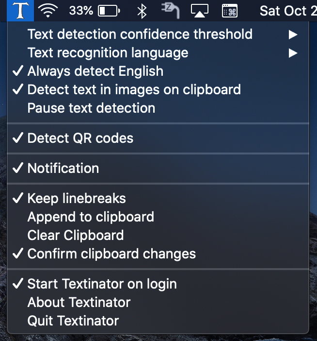

# Textinator

Simple macOS StatusBar / menu bar app to perform automatic text detection on screenshots.

## Overview

Install the app per [instructions](#installation) below.  Then, take a screenshot of a region of the screen using ⌘ + ⇧ + 4 (`Cmd + Shift + 4`).  The app will automatically detect any text in the screenshot and copy it to your clipboard.

## Installation

- clone the repo
- cd into the repo directory
- create a virtual environment and activate it
- python3 -m pip install -r requirements.txt
- python3 setup.py py2app
- Copy dist/textinator.app to /Applications
- Open System Preferences > Security & Privacy > Full Disk Access 
- Click the padlock if locked to unlock it and add Textinator to the list of allowed apps

## Usage

- Launch Textinator from the Applications folder
- Click the menu bar icon to see preferences

- Press ⌘ + ⇧ + 4 (`Cmd + Shift + 4`) to take a screenshot then paste the detected text wherever you'd like it to be.

## Settings

- `Text detection threshold confidence`: The confidence threshold for text detection.  The higher the value, the more accurate the text detection will be but a higher setting may result in some text not being detected (because the detected text was below the specified threshold). The default value is 'Low' which is equivalent to a [VNRecognizeTextRequest](https://developer.apple.com/documentation/vision/vnrecognizetextrequest?language=objc) confidence threshold of `0.3` (Medium = `0.5`, Migh = `0.8`).
- `Text recognition language`: Select language for text recognition (languages listed by [ISO code](https://en.wikipedia.org/wiki/List_of_ISO_639-1_codes) and are limited to those which your version of macOS supports).
- `Always detect English`: If checked, always attempts to detect English text in addition to the primary language selected by `Text recognition language` setting.
- `Notification`: Whether or not to show a notification when text is detected.
- `Keep linebreaks`: Whether or not to keep linebreaks in the detected text; if not set, linebreaks will be stripped.
- `Append to clipboard`: Append to the clipboard instead of overwriting it.
- `Clear clipboard`: Clear the clipboard.
- `About Textinator`: Show the about dialog.
- `Quit Textinator`: Quit Textinator.

## Inspiration

I heard [mikeckennedy](https://github.com/mikeckennedy) mention [Text Sniper](https://textsniper.app/) on [Python Bytes](https://pythonbytes.fm/) podcast [#284](https://pythonbytes.fm/episodes/show/284/spicy-git-for-engineers) and thought "That's neat! I bet I could make a clone in Python!" and here it is.  You should listen to Python Bytes if you don't already and you should go buy Text Sniper!

This project took a few hours and the whole thing is ~200 lines of Python. It was fun to show that you can build a really useful macOS native app in just a little bit of Python.

## How Textinator Works

Textinator is built with [rumps (Ridiculously Uncomplicated macOS Python Statusbar apps)](https://github.com/jaredks/rumps) which is a python package for creating simple macOS Statusbar apps.

At startup, Textinator starts a persistent [NSMetadataQuery Spotlight query](https://developer.apple.com/documentation/foundation/nsmetadataquery?language=objc) (using the [pyobjc](https://pyobjc.readthedocs.io/en/latest/) Python-to-Objective-C bridge) to detect when a new screenshot is created.

When the user creates screenshot, the `NSMetadataQuery` query is fired and Textinator performs text detection using a [Vision](https://developer.apple.com/documentation/vision?language=objc) [VNRecognizeTextRequest](https://developer.apple.com/documentation/vision/vnrecognizetextrequest?language=objc) call.

## Notes

- Doesn't work with python 3.10 as [rumps](https://github.com/jaredks/rumps) is currently not compatible with 3.10.
- If building with [pyenv](https://github.com/pyenv/pyenv) installed python, you'll need to build the python with framework support:
    - `env PYTHON_CONFIGURE_OPTS="--enable-framework" pyenv install -v 3.9.11`
- Requires a minimum of macOS Catalina (10.15).  Tested on macOS Catalina (10.15.7) and Big Sur (11.6.4); should work on Catalina or newer.

## License

MIT License

## See Also

[Text Sniper](https://textsniper.app/) which inspired this project.
