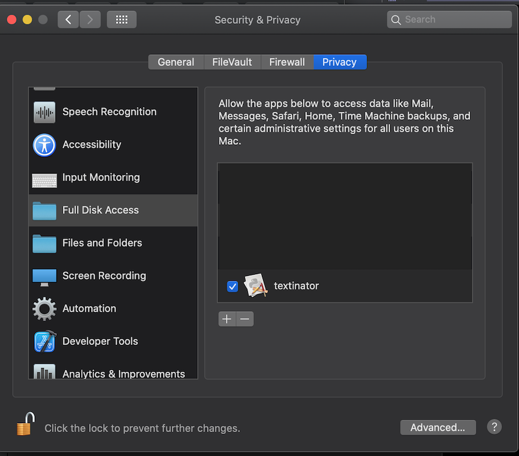
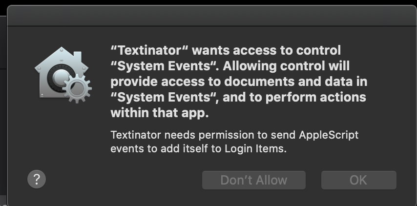

# Textinator
<!-- ALL-CONTRIBUTORS-BADGE:START - Do not remove or modify this section -->

<!-- ALL-CONTRIBUTORS-BADGE:END -->

Simple macOS StatusBar / menu bar app to perform automatic text detection on screenshots.

## Overview

Install the app per [instructions](#installation) below.  Then, take a screenshot of a region of the screen using ⌘ + ⇧ + 4 (`Cmd + Shift + 4`).  The app will automatically detect any text in the screenshot and copy it to your clipboard.

## Installation

Download and open the latest installer DMG from the [release](https://github.com/RhetTbull/textinator/releases) page then drag the Textinator icon to Applications and follow instructions below to grant Desktop access and optionally grant Full Disk Access.  

To launch Textinator the first time you'll need to right-click on the app icon and select "Open" otherwise you may get a warning about unknown developer as the app is not signed with an Apple Developer ID.

Alternatively, to build from source:

- clone the repo
- cd into the repo directory
- create a virtual environment and activate it
- python3 -m pip install -r requirements.txt
- python3 setup.py py2app
- Copy dist/textinator.app to /Applications
- Follow instructions below to grant Desktop and optionally Full Disk Access

Grant Desktop access:

Textinator works by monitoring the file system for new screenshots. The macOS security model prevents apps from accessing files and folders without the user's explicit permission. The first time you launch Textinator, you will be prompted to grant it access to your Desktop.

The default location for new screenshots on your Mac is the Desktop folder so Desktop access should be sufficient in most cases. If you want Textinator to detect screenshots in other locations or if you have [changed the default location for new screenshots](https://support.apple.com/en-us/HT201361), you will need to grant Full Disk Access.

Grant Full Disk Access:

- Open System Preferences > Security & Privacy > Full Disk Access
- Click the padlock if locked to unlock it and add Textinator to the list of allowed apps

## Upgrading

To upgrade to the latest version, download the latest installer DMG from [releases](https://github.com/RhetTbull/textinator/releases) and drag the Textinator icon to Applications.  If you have previously granted Textinator Full Disk Access, you will need to remove Textinator from Full Disk Access and re-add it per the instructions above. (This is a limitation of the macOS security model and not something Textinator can control.)

## Usage

- Launch Textinator from the Applications folder
- Grant Desktop access if prompted
- Click the menu bar icon to see preferences

- Press ⌘ + ⇧ + 4 (`Cmd + Shift + 4`) to take a screenshot then paste the detected text wherever you'd like it to be.

## Settings

- `Text detection threshold confidence`: The confidence threshold for text detection.  The higher the value, the more accurate the text detection will be but a higher setting may result in some text not being detected (because the detected text was below the specified threshold). The default value is 'Low' which is equivalent to a [VNRecognizeTextRequest](https://developer.apple.com/documentation/vision/vnrecognizetextrequest?language=objc) confidence threshold of `0.3` (Medium = `0.5`, Migh = `0.8`).
- `Text recognition language`: Select language for text recognition (languages listed by [ISO code](https://en.wikipedia.org/wiki/List_of_ISO_639-1_codes) and are limited to those which your version of macOS supports).
- `Always detect English`: If checked, always attempts to detect English text in addition to the primary language selected by `Text recognition language` setting.
- `Detect QR Codes`: In addition to detecting text, also detect QR codes and copy the decoded payload text to the clipboard.
- `Notification`: Whether or not to show a notification when text is detected.
- `Keep linebreaks`: Whether or not to keep linebreaks in the detected text; if not set, linebreaks will be stripped.
- `Append to clipboard`: Append to the clipboard instead of overwriting it.
- `Clear clipboard`: Clear the clipboard.
- `Start Textinator on login`: Add Textinator to the Login Items list so it will launch automatically when you login. This will cause Textinator to prompt for permission to send AppleScript events to the System Events app (see screnshot below).
- `About Textinator`: Show the about dialog.
- `Quit Textinator`: Quit Textinator.

When you first select `Start Textinator on login`, you will be prompted to allow Textinator to send AppleScript events to the System Events app.  This is required to add Textinator to the Login Items list. The screenshot below shows the prompt you will see.

## Inspiration

I heard [mikeckennedy](https://github.com/mikeckennedy) mention [Text Sniper](https://textsniper.app/) on [Python Bytes](https://pythonbytes.fm/) podcast [#284](https://pythonbytes.fm/episodes/show/284/spicy-git-for-engineers) and thought "That's neat! I bet I could make a clone in Python!" and here it is.  You should listen to Python Bytes if you don't already and you should go buy Text Sniper!

This project took a few hours and the whole thing is a few hundred lines of Python. It was fun to show that you can build a really useful macOS native app in just a little bit of Python.

Textinator was featured on [Talk Python to Me](https://www.youtube.com/watch?v=ndFFgJhrUhQ&t=810s)! Thanks [Michael Kennedy](https://twitter.com/mkennedy) for hosting me!

## How Textinator Works

Textinator is built with [rumps (Ridiculously Uncomplicated macOS Python Statusbar apps)](https://github.com/jaredks/rumps) which is a python package for creating simple macOS Statusbar apps.

At startup, Textinator starts a persistent [NSMetadataQuery Spotlight query](https://developer.apple.com/documentation/foundation/nsmetadataquery?language=objc) (using the [pyobjc](https://pyobjc.readthedocs.io/en/latest/) Python-to-Objective-C bridge) to detect when a new screenshot is created.

When the user creates screenshot, the `NSMetadataQuery` query is fired and Textinator performs text detection using a [Vision](https://developer.apple.com/documentation/vision?language=objc) [VNRecognizeTextRequest](https://developer.apple.com/documentation/vision/vnrecognizetextrequest?language=objc) call.

## Notes

- Doesn't work with python 3.10 as [rumps](https://github.com/jaredks/rumps) is currently not compatible with 3.10.
- If building with [pyenv](https://github.com/pyenv/pyenv) installed python, you'll need to build the python with framework support:
  - `env PYTHON_CONFIGURE_OPTS="--enable-framework" pyenv install -v 3.9.11`
- Requires a minimum of macOS Catalina (10.15).  Tested on macOS Catalina (10.15.7) and Big Sur (11.6.4); should work on Catalina or newer.

## License

MIT License

## See Also

[Text Sniper](https://textsniper.app/) which inspired this project.

## Contributors ✨

Thanks goes to these wonderful people ([emoji key](https://allcontributors.org/docs/en/emoji-key)):

<!-- ALL-CONTRIBUTORS-LIST:START - Do not remove or modify this section -->
<!-- prettier-ignore-start -->
<!-- markdownlint-disable -->
<table>
  <tbody>
    <tr>
      <td align="center"><a href="https://github.com/bwagner"> <b>Bernhard Wagner</b></a> <a href="#ideas-bwagner" title="Ideas, Planning, & Feedback">🤔</a> <a href="https://github.com/RhetTbull/textinator/commits?author=bwagner" title="Code">💻</a></td>
    </tr>
  </tbody>
</table>

<!-- markdownlint-restore -->
<!-- prettier-ignore-end -->

<!-- ALL-CONTRIBUTORS-LIST:END -->

This project follows the [all-contributors](https://github.com/all-contributors/all-contributors) specification. Contributions of any kind welcome!